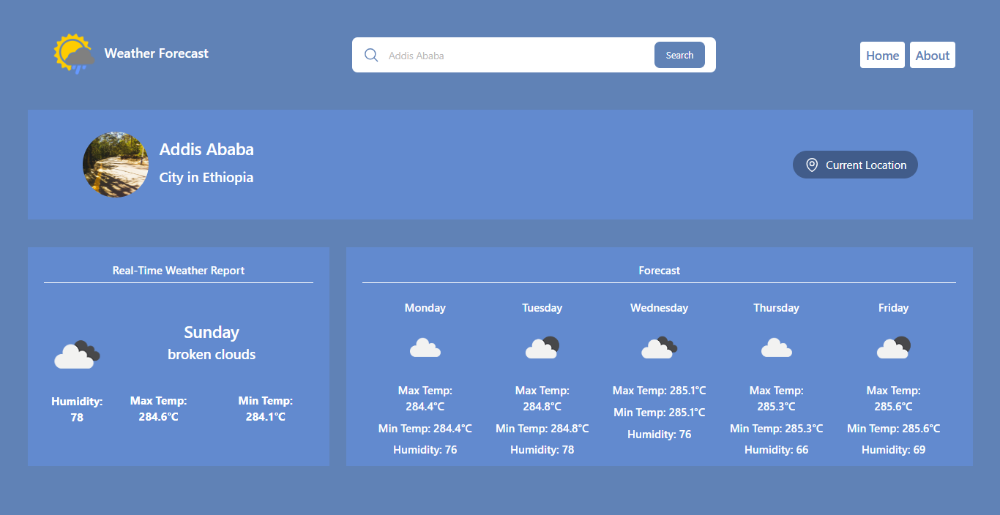

# 🌦️ **Weather Forecast App**

Welcome to the **Weather Forecast App**! This app provides real-time weather information and a 5-day forecast for cities around the world. Easily search for any city to view temperature, weather conditions, and humidity details — all in an engaging design.

---

## 📸 Screenshot



---

## 🔗 Links

- Github Repo: [Github-link](https://github.com/Mikiyas6/Weather-Forecast-Dashboard)
- Live Site URL: [Page-link](https://my-weather-forecast-dashboard.netlify.app/)

---

## 🛠️ **Setup Instructions**

Follow these steps to install dependencies and run the project locally:

1. **Clone the Repository**

   ```bash
   git clone <repository-url>
   cd <repository-folder>
   ```

2. **Install Dependencies**  
   Make sure you have **Node.js** installed, then run:

   ```bash
   npm install
   ```

3. **API Setup**

   - Obtain an API key from [OpenWeather](https://openweathermap.org/).
   - Get an Unsplash API key from [Unsplash](https://unsplash.com/developers).
   - Replace the placeholder keys in `App.js` with your API keys:
     ```javascript
     const WEATHER_API_KEY = "your_openweather_api_key";
     const UNSPLASH_CLIENT_ID = "your_unsplash_client_id";
     ```

4. **Run the Project**  
   Start the app in development mode:
   ```bash
   npm start
   ```
   The app will open at `http://localhost:3000` in your browser. 🎉

---

## 💻 **Technologies Used**

This project leverages the following tools and technologies:

- **React.js** ⚛️ - JavaScript library for building user interfaces
- **CSS** 🎨 - Styling the components
- **OpenWeather API** 🌐 - Fetching weather data
- **Unsplash API** 🖼️ - Retrieving city images
- **Google Geocoding API** 🗺️ - Reverse geolocation for country lookup
- **Media Queries** 📱 - Ensuring responsive design across devices

---

## 🐞 **Known Issues & Assumptions**

- **Assumptions:**

  - Default city is set to **Addis Ababa** on initial load.
  - The forecast only updates when the user submits a valid city name.

- **Known Issues:**
  - **Image Retrieval Limitations:** Unsplash API may not always return relevant or available city images.
  - **API Key Restrictions:** If API keys are overused or misconfigured, some features may not work as expected.

---

## 📂 **Project Structure**

```bash
├── public/
│   └── index.html
├── src/
│   ├── App.js          # Main React component
│   ├── index.css       # Global styling
│   ├── Queries.css     # Responsive design styles
│   └── index.js        # Entry point for React app
├── package.json        # Project dependencies and scripts
└── README.md           # Documentation
```

---

## 📧 **Contact**

For any questions or feedback, feel free to reach out!

- **Email:** Mikiyas.Tewodroes@A2SV.org
